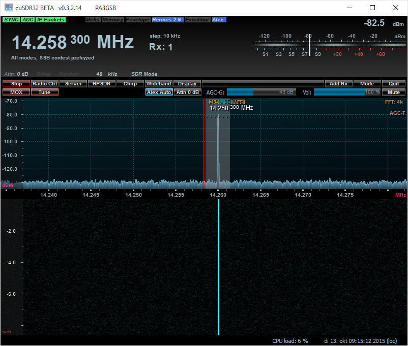

RadioBerry - Ham Radio cape for Raspberry PI
==============================================

## Main purpose of the project:

- Building a HAM Radio
- Learning (from noob to guru)

## Radioberry:

- Raspberry PI 2 Model B
- Radio extension board (cape)
	- using AD9866 (12 bit)  for RX and TX modes.
- Using JAVA as programming language.

	Two java applications are being under development:
	
	- HermesLite 
	- Radio Berry
		On the RPI a webserver (using websockets for spectrum and audio) including the ported WDSP lib

## HermesLite

Starting hermes lite using the following command:  java -jar hermeslite.jar 

Start a SDR software program; i used cuSDR and tune to 14.260.000 Hz.

## (Web) RadioBerry

Starting RadioBerry using the following command:  java -jar radioberry.jar 

Oeps.. in the WeServer class i hard coded an IP address ... for now modify and export the jar file...

Open a modern browser and start the URL ; i have created an initial ssb.html! 

For different modes an unique interface can be designed.

## Hardware

TODO....

