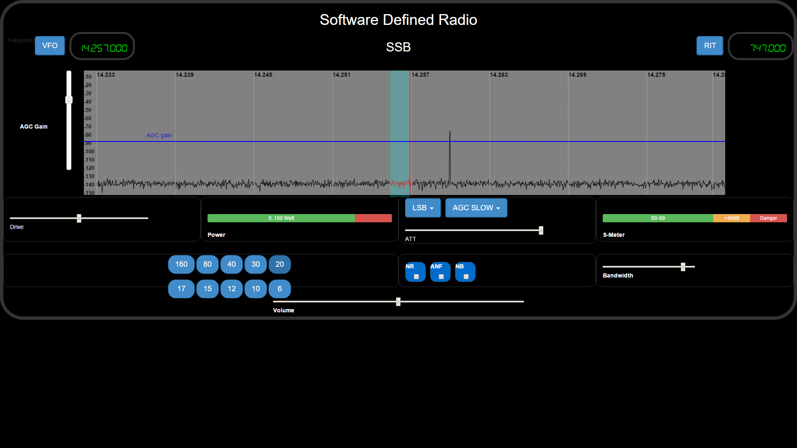
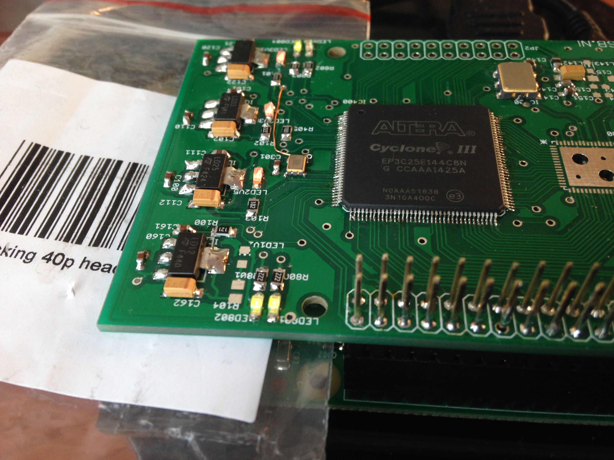

RadioBerry - Ham Radio cape for Raspberry PI
==============================================

## Main purpose of the project:

- Building a HAM Radio
- Learning (from noob to guru)

## Radioberry:

- Raspberry PI 2 Model B
- Radio extension board (cape)
	- using AD9866 (12 bit)  for RX and TX modes.
	

	
	
## Radioberry Configurations:

	Initialy i had the idea of using JAVA as then main programming language, 
	but the lack of speed when reading and writing to the GPIO of the raspberry pi 
	forced me to use the 'C' programming language.
	
	Setting the SI570 at the right fequency is done using the I2C bus of the pi and a JAVA progam.

	Three applications are being under development:
	
	- HermesLite 
	- Radio Berry
		On the RPI a webserver (using websockets for spectrum and audio) including the ported WDSP lib
	- Standalone transceiver

## HermesLite

Using a SDR program via the OPENHPSDR protocol and a network connection.

Starting hermes lite (c-program) using the following command:  sudo ./hermeslite

Start a SDR software program; 

## (Web) RadioBerry

Starting RadioBerry using the following command:  java -jar radioberry.jar 

Internally using the WDSP library.

Oeps.. in the WeServer class i hard coded an IP address ... for now modify and export the jar file...

Open a modern browser and start the URL ; i have created an initial ssb.html! 

For different modes an unique interface can be designed.

Because of the performance problems i have to change from JAVA using an embedded JETTY server to C using mongoose as webserver.
But the idea of making special pages for the different modes still stands!

## Standalone transceiver

Using a touch display and maybe some knobs.... 

As DSP lib using the WDSP library.

## Hardware

Schema and layout available. The print is created by elecrow. 

As can be seen in the picture the first components are mounted and the first firmware is loaded; showing the heart beat!

Some schema and layout errors:

	- )	Pin 23 AD9866 not connected to FPGA!
	- )	10 MHz not connected to 3.3V
	- ) LED for the 1V2 is not needed; the LED need at least 1.4..1.5V

